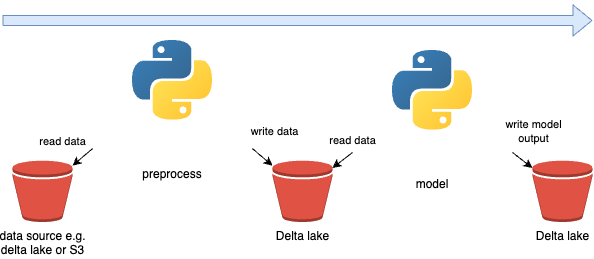
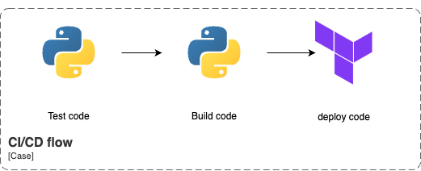

# Case study 

Given a notebook running a CLTV model how can this code be restructured to be more ready for production?

## Problems identified in the notebook

The notebook depends alot on Pandas which, if we are going to run this notebook on a lot of data will potentially give us problems. Pandas in itself does not distribute computing in the same way that spark does for instance. This means that we can run into a scenario where there is too much data to run part of the notebook.

The notebook only lives in the data scientists environment with no "scaffolding" around it. This means that it might run on the machine of the data scientist but not necessarily anywhere else. None of the versions of pypi packaged are fixed, so it could also break at any time if a package is updated (breaking change).

## New structure

The notebook has been split into 3 parts, the pre-processing of the data, the modeling part and a utils part.

Splitting up the code like this gives multiple different advantaged over having a single notebook. The code becomes more easily testable by being able to test some of the logic used in unit tests. The pre-processing step can be tested as a whole to verify no side effects. Since the model step looks to be very deterministic this step can also be tested to verify the "integrity" of the model step.

The utils code can be reused in other jobs that need the same functionality. 

The pre-processing step outputs the data which is then read by the model step. This also ensures we can reuse the output of the preprocessing step for another model for instance that require the same data instead of having to pre-process the data twice.

The code has been put into a python wheel meaning it can be installed in a spark cluster and the methods on it called. Currently there are 2 main entrypoints for pro-processing and model step. Additionally a wheel also contains the dependencies needed to run whatever is in it in the required packaged ensuring we have the exact same dependencies on every run with the same wheel. 

The preprocessing has been implemented in pyspark instead of pandas to avoid the problems described earlier. The modeling step is still in pandas since the models are not easily available in pyspark if at all. The data has already in the preprocessing step been reduced quite a lot by removing outliers and by filtering customers who have purchased something twice or more (in the last year) which will avoid some of the problems one could run into with pandas and a lot of data. 

## Github actions

In a CI/CD context I would put a few steps in the pipeline to try make sure we only deploy working code and also making deploying easy. This process involes Testing (CI) and Building + deploying the code (CD). I already put in a pytest for one of the utils functions which would be included in the test step. Building the wheel would be in the build step and lastly a deploy step would deploy the databricks job(s). 

For deployment I would use terraform to manage this databricks workflow since this is the recommended way of doing it by databricks and it has advantages over other approaches (e.g. using the CLI). Another reason for going with terraform is being the eco system in this case involved both AWS and Databricks meaning some artifacts from AWS might need to be taken into account when deploying to databricks and using terraform can tie these two environments together.

## Handover process of notebooks

Overall the notebook had a good structure indicating what was happening at each step which made understanding the notebook quite easy and finding out how to structure the notebook in a production environment more straight forward than I think it would be otherwise. 

Good documentation overall improves the handover process. This entails documentation of the code itself, the data going into the notebook and what data the notebook is generating. Furthermore a code-review could be helpful to have better code in the notebook, 

